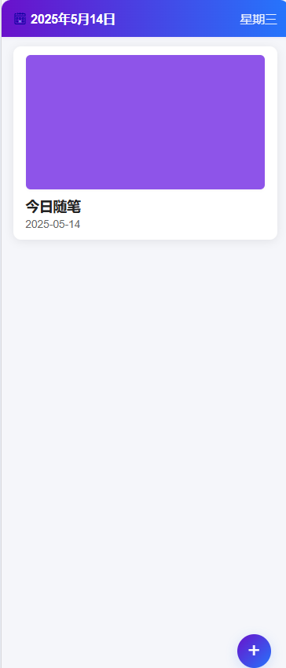

# Vlog日记应用

这是一个基于uni-app开发的Vlog日记应用，主要适配移动端可以使用hbuilderx生成安卓/ios/鸿蒙软件或者各类小程序，用户可以通过该应用记录日常生活，创建、编辑和管理个人日记，并支持视频和图片上传功能。

## 项目概述

本项目目前已完成前端效果的开发，并将所有后端接口需求整合到`src/api/index.js`文件中。为了便于后续后端开发，项目提供了完整的API接口文档（见`docs/backend_integration_guide.txt`），详细说明了所需的所有接口和数据结构。

### 技术特点

- 基于uni-app框架开发，支持跨平台部署
- 纯前端实现，使用模拟后端数据进行功能展示
- 采用模块化设计，API接口集中管理
- 优雅的UI设计和流畅的用户体验

## 功能展示

### 1. 登录界面

提供用户登录功能，支持邮箱和手机号格式验证。

<div align="center">
  
</div>

### 2. 登录加载

登录过程中显示连接服务器的加载动画，增强用户体验。

<div align="center">
  
</div>

### 3. 注册验证

严格的注册表单验证，包括账户格式验证、密码强度检查和重复密码确认。

<div align="center">
  
</div>

### 4. 主页界面

显示用户日记列表，未登录用户无法访问。主页支持日期导航和日记预览，封面为随机颜色。

<div align="center">
  
</div>

### 5. 新增日记

用户可以创建新日记，添加标题、内容、Vlog视频和封面图片。

<div align="center">
  
</div>

### 6. 编辑日记

编辑已有日记的内容，支持修改文字内容和媒体文件。图为无图片/视频的编辑界面。

<div align="center">
  
</div>

### 7. 日期选择器

精美的日期选择器，支持日期切换和月份导航，方便查看不同日期的日记。

<div align="center">
  
</div>

### 8. 主页封面效果

当日记有封面图时，主页会显示实际封面而非随机颜色。

<div align="center">
  
</div>

### 9. 编辑日记-带媒体

编辑带有图片或视频的日记界面，支持预览和更换媒体内容。

<div align="center">
  
</div>

## 技术特性

- **用户认证系统**：完整的登录/注册功能，支持表单验证
- **日记管理**：创建、查看、编辑和删除日记
- **媒体支持**：支持上传视频和图片作为日记内容
- **日期导航**：直观的日历界面，方便浏览不同日期的日记
- **响应式设计**：适配不同设备屏幕尺寸
- **模拟后端**：前端模拟了后端API，方便开发和测试

## 后端集成

项目提供了完整的后端开发需求文档，位于`docs/backend_integration_guide.txt`，包含：

- API接口规范
- 数据库设计
- 安全考虑
- 前端修改指南

真实后端开发完成后，只需要修改API接口文件即可无缝集成。

## 联系方式

本项目仅展示前端效果，如需完整代码或有其他问题，请通过微信联系：

**微信**：iamjuicymelon

---

## 开发与部署

### 依赖安装

```bash
npm install
```

### 运行项目

```bash
npm run dev:h5
```

### 项目构建

```bash
npm run build:h5
```

---
